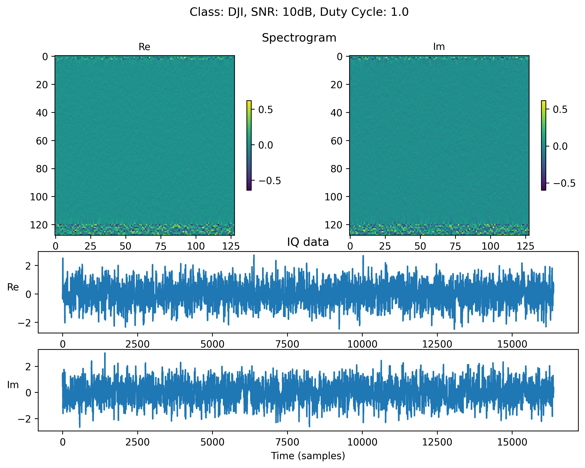

# Noisy Drone RF Signal Classification Dataset
Scripts to load and inspect the drone detection benchmark dataset

## Dataset
The dataset is available at [kaggle](https://www.kaggle.com/datasets/sgluege/noisy-drone-rf-signal-classification). Download the dataset and place it in a subfolder `dataset/`. 

It comes in the form of 3 files:
- `class_stats.csv`: contains the number of samples per class
- `SNR_stats.csv`: contains the number of samples per SNR
- `dataset.pt`: contains the dataset itself

## Load and inspect the dataset
Use the script `load_dataset.py` to load the dataset using a custom torch Dataloader. It also plots a sample of the dataset which should look like this: 


## Cite the data

If you find the data useful for your work please cite our related paper https://www.scitepress.org/Link.aspx?doi=10.5220/0012176800003595.

Glüge, S.; Nyfeler, M.; Ramagnano, N.; Horn, C. and Schüpbach, C. (2023). Robust Drone Detection and Classification from Radio Frequency Signals Using Convolutional Neural Networks. In Proceedings of the 15th International Joint Conference on Computational Intelligence - NCTA; ISBN 978-989-758-674-3; ISSN 2184-3236, SciTePress, pages 496-504. DOI: 10.5220/0012176800003595

Bibtex:
```
@conference{ncta23,
author={Stefan Glüge. and Matthias Nyfeler. and Nicola Ramagnano. and Claus Horn. and Christof Schüpbach.},
title={Robust Drone Detection and Classification from Radio Frequency Signals Using Convolutional Neural Networks},
booktitle={Proceedings of the 15th International Joint Conference on Computational Intelligence - NCTA},
year={2023},
pages={496-504},
publisher={SciTePress},
organization={INSTICC},
doi={10.5220/0012176800003595},
isbn={978-989-758-674-3},
issn={2184-3236},
}
```
